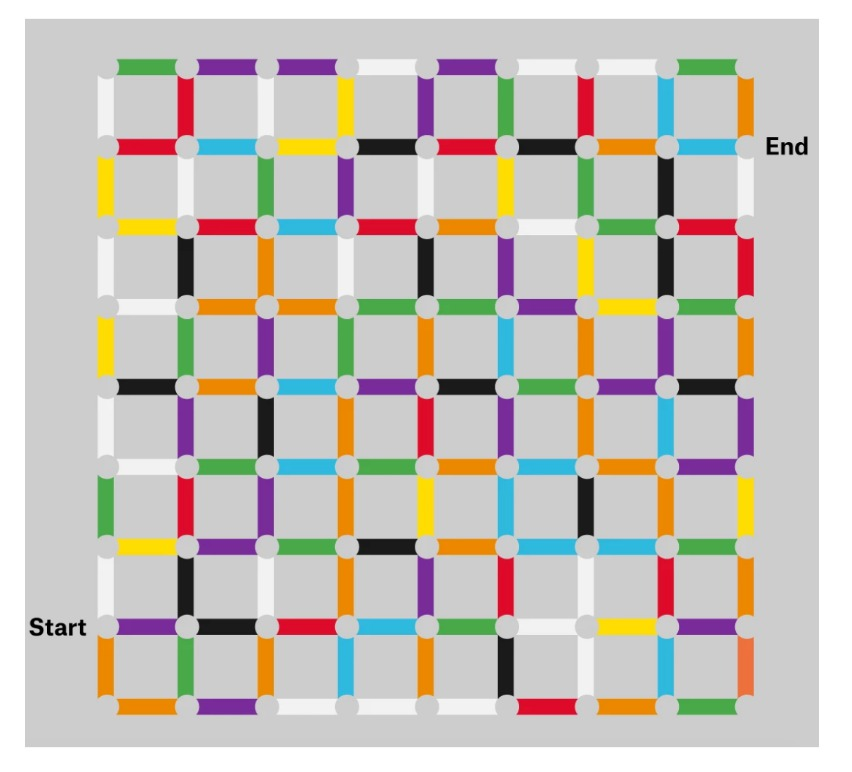

# How Many Soldiers Do You Need To Beat The Night King?

>**Riddler Express:** In grade school, you may have learned about the three primary colors — blue, yellow and red — and the three secondary colors — green (blue + yellow), purple (red + blue) and orange (yellow + red). And now it’s time to put that knowledge to use. Try to get through the maze below, a nine-by-nine grid of lines, three times: once as blue, once as yellow, and once as red. If you are blue, you may only travel on lines that include the color blue. So you may travel on lines that are blue, green, purple or white (which contains all colors). You may not travel on orange, yellow, red or black (which contains no colors). The analogous rules hold for your trips as yellow and red.

**Solution**:

When I first saw this problem, I was ready to print it out and have some fun figuring out the maze. However, that would be way to easy. Instead I created a graph implementation of the maze, storing the colors as the edges between the nodes. I first used general DepthFirstSearch to find a solution to the problem. To make sure I was finding the shortest path through the maze I also used Dijkstra's algorithm. My answers are stored in the results directory. There is a diagram for each of the three colors and a general txt file that gives the path order and length.

In the end it took 26 total moves for blue, 24 for red, and 36 for yellow.
